🎙️ Piper TTS Forge

**A streamlined, toolkit for training custom Neural Text-to-Speech (TTS) voices using [Piper](https://github.com/rhasspy/piper).**

This project automates the most painful parts of voice cloning:

* Automatic slicing and transcription using **OpenAI Whisper**
* Dataset formatting for Piper
* Training, checkpoint management, and export
* Real-time dashboard to listen to your model as it learns

---

## ⚠️ Hardware & Storage Requirements

**Read before running `2_slice_and_transcribe.py`.**

### Storage

* **Recommended:** ≥100 GB free space
* Training checkpoints are large. Backups will duplicate the training folder, requiring extra space.

### GPU / VRAM

* Whisper “large” model requires **~10 GB VRAM** (RTX 3080 / 4070 or better)
* For lower VRAM (RTX 3060, 2060, GTX 1080, etc.), switch to **Whisper medium** in `2_slice_and_transcribe.py`:

```python
# FROM:
model = whisper.load_model("large", device=device)

# TO:
model = whisper.load_model("medium", device=device)
```

> Medium model is faster, uses less VRAM, and ~95% as accurate.

---

## 🔄 Workflow

```mermaid
graph TD;
    A[🎤 Raw Audio] -->|Script 2| B(🔪 Slicer & Whisper);
    B -->|Generates| C[📂 Dataset & Metadata];
    C -->|Script 3| D(⚙️ Preprocessing);
    D -->|Generates| E[🔢 Tensors];
    E -->|Script 4| F(🚂 Training Loop);
    F -->|Script 5| G(📡 Dashboard / Preview);
    G -->|Stop Training| H(🛡️ Backup Manager);
    H -->|Script 6| I(📦 Export ONNX);
    I -->|Script 7| J(🗣️ Inference);
```



---

## 📂 Folder Structure

```
.
├── piper/                 # Piper GitHub release
│   ├── piper              # Piper executable
│   └── src/               # Piper Python source
├── raw_audio/             # Place long .wav/.mp3 files here
├── config.py              # <-- EDIT THIS FIRST
├── environment.yml
└── [1-8]_*.py             # Automation scripts
```

---

## 🛠️ Prerequisites

### Linux (Ubuntu / Debian)

```bash
sudo apt-get install espeak-ng g++
```

### Windows

* Visual Studio C++ Build Tools
* eSpeak-NG in PATH

### Python Environment (Conda recommended)

```bash
conda env create -f environment.yml
conda activate piper-trainer
```

---

## 🚀 Usage Guide

### 1. Configuration & Setup

Edit `config.py` to set `VOICE_NAME` and run:

```bash
python 1_setup.py
```

If the base model is missing, instructions will be provided to download and place it.

---

### 2. Prepare Audio

* Place recordings in `raw_audio/`
* Formats: WAV, MP3, FLAC, M4A
* Length: 15–60 minutes total
* Single speaker, no music, minimal background noise

---

### 3. Slicing & Transcription

```bash
python 2_slice_and_transcribe.py
```

* Inspects `dataset/metadata.csv` after completion
* Remove junk lines (e.g., "Copyright", "Subtitle")

---

### 4. Preprocessing

```bash
python 3_preprocess.py
```

* Converts audio and text into Piper-ready tensors

---

### 5. Training

```bash
python 4_train.py
```

* Press `Ctrl+C` to pause safely and resume later

---

### 6. Dashboard (Live Monitoring)

```bash
python 5_dashboard.py
```

* Detects new checkpoints automatically
* Speaks a sample line at each checkpoint
* Shows training health (Warmup → Sweet Spot → Overfitting)

---

### 7. Backup & Restore

⚠️ **Do not backup while training is writing files.**

Steps:

1. Manually stop training (`Ctrl+C`)
2. Run manager:

```bash
python 8_checkpoint_manager.py
```

3. Choose **Option 1 (Backup)**
4. Resume training as needed

* Restore backups if voice quality degrades

---

### 8. Export Final Model

```bash
python 6_export.py
```

* Final files appear in `final_models/`

---

### 9. Talk (Inference)

```bash
python 7_talk.py
```

* Test your new voice interactively

---

## 🧠 Training Guide

| Stage      | Epochs      | Sound Characteristics                   | Action         |
| ---------- | ----------- | --------------------------------------- | -------------- |
| Warmup     | 0 - 500     | Muffled, skipping words, noise static   | Keep Going     |
| Learning   | 500 - 1500  | Recognizable voice, lacks cadence       | Monitor        |
| Sweet Spot | 1500 - 3500 | Clear, emotional, natural breathing     | STOP & BACKUP  |
| Overfit    | 4000+       | Metallic, robotic pitch, high-frequency | Restore Backup |

---

## 🔧 Troubleshooting

* **CUDA Out of Memory:** Lower `BATCH_SIZE` in `config.py` (16 → 8 → 4)
* **Piper source not found:** Ensure `piper/src/` exists (correct release downloaded)
* **Voice sounds metallic:** Overfitting, restore earlier backup

---

## ⚖️ License

* **Automation Toolkit:** Open source
* **Piper Engine:** MIT © Rhasspy contributors
