🎙️ Piper TTS Forge
*Tested on Debian Linux Variants (Windows instructions are theoretical guidelines only)*

A streamlined toolkit for training custom Neural Text-to-Speech (TTS) voices using [Piper](https://github.com/rhasspy/piper).

This project automates the most painful parts of voice cloning:

- Automatic slicing and transcription using **OpenAI Whisper**
- Dataset formatting for Piper
- Training, checkpoint management, and export
- A real-time dashboard to *listen* to your model as it learns

---

## ⚠️ Hardware & Storage Requirements (Important)

**Read this before running `2_slice_and_transcribe.py`.**

### 1. Storage Warning
⚠️ **Disk Space:** At least **100 GB** of free space is recommended.  
Training checkpoints are large. Backups (Script 8) duplicate the training folder, requiring more space.

### 2. VRAM Warning (GPU)
The slicer uses the **Whisper “large” model** by default for maximum transcription accuracy.

- **Requirement:** ~10 GB VRAM or more (RTX 3080 / 4070 or better).

**For GPUs with less VRAM (RTX 3060, 2060, GTX 1080, etc.):**  
Switch Whisper to the **medium** model to avoid crashes:

```python
# Edit 2_slice_and_transcribe.py
# FROM:
model = whisper.load_model("large", device=device)

# TO:
model = whisper.load_model("medium", device=device)
````

The medium model is faster, uses less VRAM, and is ~95% as accurate.

---

## 📂 Folder Structure

Your directory must look like this before starting. You will manually create the `piper/` folder in the next step.

```
.
├── piper/                 # <--- YOU MUST BUILD THIS MANUALLY
│   ├── piper              # The executable file (piper.exe on Windows)
│   └── src/               # The Python source code folder
├── raw_audio/             # Put your long .wav / .mp3 files here
├── config.py              # <-- EDIT THIS FIRST
├── environment.yml
└── [1-8]_*.py             # Automation scripts
```

---

## 🛠️ Prerequisites & Manual Setup

### 1. System Dependencies

**Linux (Ubuntu / Debian):**

```bash
sudo apt-get install espeak-ng g++
```

**Windows (theoretical guideline, not tested):**

* Visual Studio C++ Build Tools
* eSpeak-NG (Install and ensure it is in your system PATH)

### 2. Python Environment (Recommended: Conda)

```bash
conda env create -f environment.yml
conda activate piper-trainer
```

### 3. Piper Engine Setup (Crucial Step)

This project requires both the engine (to run audio) and the source code (to train). You must download two separate files and merge them.

**Step A: Get the Executable**

1. Go to the [Piper Releases Page](https://github.com/rhasspy/piper/releases).
2. Download the compressed file for your OS (e.g., `piper_windows_amd64.zip` or `piper_linux_x86_64.tar.gz`).
3. Extract it. You should now have a folder named `piper` containing the executable.
4. Place this `piper` folder in the root of this project.

**Step B: Get the Source Code**

1. On the same Releases page, scroll to the **Assets** section.
2. Download **Source code (zip)**.
3. Extract it. You will see a folder like `piper-2023.11.14-2`.
4. Locate the `src` folder inside.

**Step C: Merge Them**

1. Copy the `src` folder from Step B.
2. Paste it inside your `piper` folder from Step A.

Your folder structure should now match the diagram above.

---

## 🚀 Usage Guide

### 1. Configuration & Setup

Open `config.py` and set your `VOICE_NAME`. Then run:

```bash
python 1_setup.py
```

This script verifies your folder structure. If you are missing the Base Model (checkpoint), it will provide the URL to download it manually.

### 2. Prepare Audio

* Drop recordings into `raw_audio/`
* Format: WAV, MP3, FLAC, M4A
* Length: 15–60 minutes total
* Quality: Single speaker, no music, minimal background noise

### 3. Slicing & Transcription

```bash
python 2_slice_and_transcribe.py
```

Inspect `dataset/metadata.csv` and remove junk lines (e.g., "Copyright", "Subtitle").

### 4. Preprocessing

```bash
python 3_preprocess.py
```

Converts audio and text into Piper-ready tensors.

### 5. Training

```bash
python 4_train.py
```

Press `Ctrl+C` to pause safely. Run the script again to resume.

### 6. Dashboard (Live Monitoring)

While training runs in one terminal, open another and run:

```bash
python 5_dashboard.py
```

Generates an audio file named:

👉 `preview_progress.wav` 👈

Listen frequently—it updates automatically as training progresses.

### 7. Backup & Restore (Script 8)

⚠️ Cannot backup while training writes files.

Listen to `preview_progress.wav`.
If at the "Sweet Spot," stop training (`Ctrl+C`) and run:

```bash
python 8_checkpoint_manager.py
```

Select Option 1 (Backup). To restore if overfitting occurs, run the script again and choose Restore.

### 8. Export Final Model

```bash
python 6_export.py
```

Final files appear in `final_models/`.

### 9. Talk (Inference)

```bash
python 7_talk.py
```

---

## 🔄 Workflow Diagram

```mermaid
graph TD;
    A[🎤 Raw Audio] -->|Script 2| B(🔪 Slicer & Whisper);
    B -->|Generates| C[📂 Dataset & Metadata];
    C -->|Script 3| D(⚙️ Preprocessing);
    D -->|Generates| E[🔢 Tensors];
    E -->|Script 4| F(🚂 Training Loop);
    F -->|Script 5| G(📡 Dashboard / Preview);
    G -->|Stop Training| H(🛡️ Backup Manager);
    H -->|Script 6| I(📦 Export ONNX);
    I -->|Script 7| J(🗣️ Inference);
```



---

## 🧠 Guide: When to Stop Training

| Stage      | Epochs (Approx) | Sound Characteristics                     | Action         |
| ---------- | --------------- | ----------------------------------------- | -------------- |
| Warmup     | 0 - 500         | Muffled, skipping words, noise static     | Keep Going     |
| Learning   | 500 - 1500      | Recognizable voice, lacks cadence         | Monitor        |
| Sweet Spot | 1500 - 3500     | Clear, emotional, good breathing, natural | STOP & BACKUP  |
| Overfit    | 4000+           | Metallic buzz, robotic pitch              | Restore Backup |

---

## 🔧 Troubleshooting

* **CUDA Out of Memory:** Lower `BATCH_SIZE` in `config.py` (16 → 8 → 4)
* **“Piper source code not found”:** Ensure `piper/src/` exists. Likely forgot to merge Source Code into binary.
* **Voice sounds metallic:** Overfitted; restore an earlier backup.

---

## ⚖️ License

This automation toolkit is open source. The Piper engine is MIT licensed (c) Rhasspy contributors.

